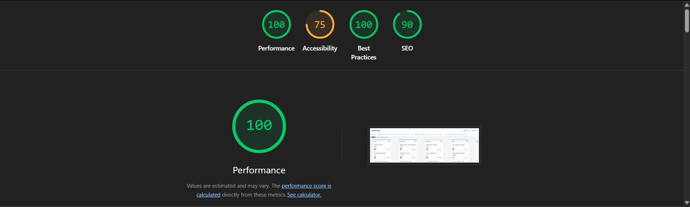

# Project Tracker

A fully functional multi-view project management tool built with React + TypeScript.

## Live Demo
(https://project-tracker-psi-five.vercel.app/)

## LightHouse Performance

<p align="center">
  
</p>

## 📸 Preview

<p align="center">
  
</p>
<p align="center">
  
</p>
<p align="center">
  
</p>

## Setup
```bash
npm install
npm run dev
```

## Features

- Kanban board with 4 columns
- List view with sorting and inline status updates
- Timeline / Gantt view for current month
- Custom drag and drop (no libraries)
- Virtual scrolling (handles 500+ tasks smoothly)
- Live collaboration indicators (WebSocket simulation)
- Filters with URL sync (shareable + bookmarkable)

## Tech Stack

- React + TypeScript
- Tailwind CSS
- React Context + useReducer
- react-router-dom (URL sync)
- Vite

## State Management

I used React Context + useReducer over Zustand because the app state is straightforward — a single global store with predictable actions. useReducer gives full control over state transitions without adding a dependency, and the AppAction union type makes every possible state change explicit and type-safe.

## Virtual Scrolling

Implemented from scratch without any library. The approach:
- Fixed row height (56px for list, 40px for timeline)
- On scroll, calculate startIndex = scrollTop / ROW_HEIGHT
- Only render rows from startIndex to startIndex + visibleCount
- Rows are absolutely positioned inside a container whose height equals totalRows * ROW_HEIGHT
- Keeps the DOM lean — only ~20 rows rendered at any time regardless of dataset size
- Used ResizeObserver to track container height dynamically

## Drag and Drop

Built using native Pointer Events API — no react-beautiful-dnd, no dnd-kit.

- pointerdown captures exact click offset within the card
- Window-level pointermove updates ghost position via direct DOM manipulation — no React state, no re-renders, smooth 60fps
- Column highlight on hover done via direct classList — avoids re-renders at column borders
- pointerup checks which column cursor is over and dispatches MOVE_TASK
- Dropped outside valid column — card snaps back automatically

The hardest part was keeping layout shift zero while dragging. Solved by keeping the original card in place with reduced opacity rather than removing it from DOM.

## Explanation

The hardest UI problem was the drag placeholder without layout shift. When a card is picked up, removing it from the DOM causes all cards below to shift up instantly which looks jarring. Keeping it in place with opacity 0.3 solved this cleanly. One thing I'd refactor with more time is the collaboration simulation — currently it re-initialises whenever tasks.length changes. I'd use a stable ref for the task id pool so the interval never needs to restart.
